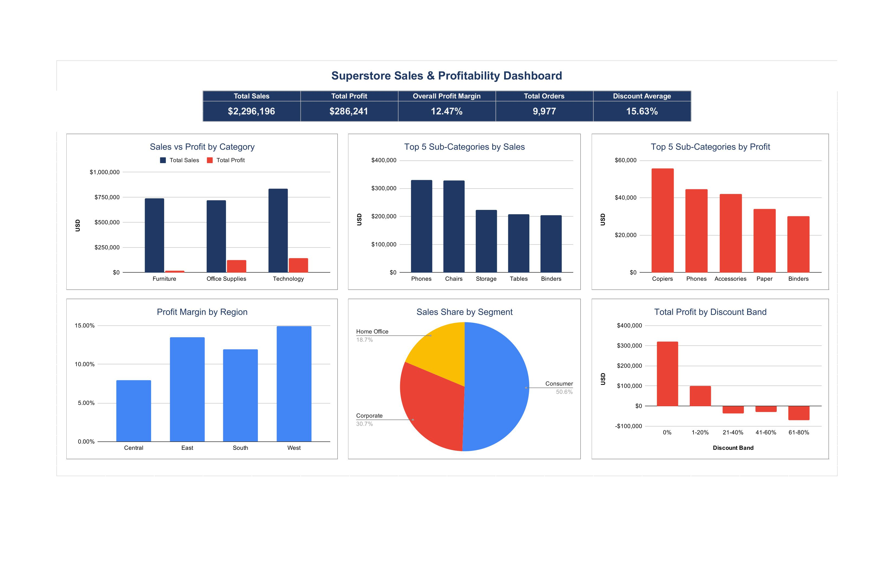

# Superstore Business Analytics

## Project Overview

This project analyzes Superstore transactional sales data to evaluate business performance across products, customers, and geographic regions.

The project focuses on identifying sales and profitability patterns, evaluating product and regional performance, understanding customer segment contribution, and examining the relationship between discounting and profitability.

The analysis was conducted using spreadsheet-based data cleaning, pivot tables, formulas, data visualization, and dashboard development.

---

## Business Questions

This project aims to answer the following business questions:

1. How is the overall sales and profit performance?
2. Which product categories and sub-categories generate the highest sales and profit?
3. Which regions perform best in terms of profitability?
4. Which customer segments contribute the most to sales?
5. How does discounting relate to profitability?
6. Which areas of the business require further attention or improvement?

---

## Dataset

- **Dataset:** Sample Superstore (https://www.kaggle.com/datasets/roopacalistus/superstore)
- **Data Type:** Transactional sales data
- **Granularity:** Individual order line / transaction
- **Records After Cleaning:** 9,977
- **Main Dimensions:** Segment, Region, State, Category, Sub-Category, Ship Mode
- **Main Measures:** Sales, Quantity, Discount, Profit

The dataset does not contain order or shipping dates, so time-series analysis was not included in this project.

---

## Data Preparation

The dataset was reviewed and prepared before analysis.

Key data preparation steps included:

- Checking for missing values
- Identifying and removing duplicate records
- Validating data types and categorical values
- Formatting discount values as percentages
- Retaining negative profit records for profitability analysis
- Creating calculated fields for profit margin and profitability classification

A total of **9,994 raw records** were identified, with **17 duplicate records removed**, resulting in **9,977 records** for analysis.

---

## Analysis

The analysis was performed using spreadsheet formulas and Pivot Tables.

The analytical areas include:

### Overall Business Performance
- Total Sales
- Total Profit
- Total Quantity
- Profit Margin
- Average Discount
- Loss-Making Transactions

### Product Performance
- Sales and profit by category
- Sales and profit by sub-category
- Top 5 sub-categories by sales
- Top 5 sub-categories by profit

### Geographic Performance
- Sales and profit by region
- Profit margin by region
- State-level profitability analysis

### Customer Segment Performance
- Sales contribution by customer segment
- Profit and profit margin by segment

### Discount & Profitability
- Profit performance across discount bands
- Relationship between higher discounts and profitability

### Shipping Performance
- Sales and profit by ship mode

---

## Spreadsheet

The complete analysis, including data cleaning, Pivot Tables, analysis, dashboard, insights, and recommendations, is available in the following Google Sheets workbook:

**[View Full Spreadsheet Analysis](https://docs.google.com/spreadsheets/d/1dZh0KcbKyEy0xgiPxhEyDWzz5lBB1LynkRPy4d0WGVk/edit?usp=sharing)**

## Dashboard

The dashboard provides a visual summary of the main business findings, including sales, profitability, product performance, regional performance, customer segments, and discount impact.

**[View Full Interactive Spreadsheet](https://docs.google.com/spreadsheets/d/1dZh0KcbKyEy0xgiPxhEyDWzz5lBB1LynkRPy4d0WGVk/edit?usp=sharing)**



### Dashboard Components

- **KPI Summary:** Total Sales, Total Profit, Overall Profit Margin, Total Orders, and Average Discount
- **Sales vs Profit by Category**
- **Top 5 Sub-Categories by Sales**
- **Top 5 Sub-Categories by Profit**
- **Profit Margin by Region**
- **Sales Share by Customer Segment**
- **Total Profit by Discount Band**

---

## Key Findings

### 1. Strong Sales Performance but Moderate Profitability

The business generated approximately **$2.30M in sales** and **$286K in profit**, resulting in an overall profit margin of **12.47%**.

However, **1,869 transactions were loss-making**, indicating that profitability remains an important area for improvement.

### 2. Technology is the Strongest Product Category

Technology generated the highest sales at approximately **$836K** and the highest profit at approximately **$145K**, with a **17.40% profit margin**.

### 3. Furniture Has Weak Profitability

Furniture generated approximately **$741K in sales**, but only **$18K in profit**, resulting in a low **2.49% profit margin**.

The main profitability concerns are:

- Tables: **-$17.7K profit**
- Bookcases: **-$3.5K profit**

### 4. Higher Discounts Are Associated with Lower Profitability

Transactions with no discount generated a **29.51% profit margin**.

Profitability declined substantially as discount levels increased, with discount bands above 20% generating negative profit margins.

The 61–80% discount band recorded a **-122.63% profit margin**.

### 5. West is the Strongest Region

The West region generated approximately **$725K in sales** and **$108K in profit**, achieving the highest regional profit margin of **14.94%**.

### 6. Consumer Has the Largest Sales Share

Consumer contributed the largest share of sales at approximately **50.6%**, followed by Corporate at **30.7%** and Home Office at **18.7%**.

However, Home Office achieved the highest profit margin at **14.04%**.

---

## Recommendations

Based on the analysis, the following actions are recommended:

### 1. Tighten Discount Controls

Review transactions with discounts above 20%, as higher discount levels are associated with substantially lower profitability.

Consider implementing discount thresholds or approval rules for high-discount transactions.

### 2. Review Furniture Profitability

Investigate pricing, discounting, and cost structures for loss-making Furniture sub-categories, particularly Tables and Bookcases.

### 3. Investigate Loss-Making States

Conduct targeted profitability reviews in high-sales states with negative profit, including Texas, Ohio, Pennsylvania, and Illinois.

### 4. Prioritize High-Performing Products

Continue supporting Technology and high-margin sub-categories such as Copiers, Accessories, and Paper through inventory planning and targeted sales strategies.

### 5. Explore High-Margin Customer Segments

Consider growth opportunities in the Home Office segment, which achieved the highest profit margin among customer segments.

### 6. Prioritize Strong Geographic Markets

West and East demonstrate strong sales and profitability performance and can be prioritized for customer retention and growth initiatives.

---

## Tools

- Microsoft Excel / Google Sheets
- Pivot Tables
- Spreadsheet Formulas
- Data Cleaning
- Data Visualization
- Dashboard Development
- Business Analytics

---

## Repository Structure

```text
superstore-business-analytics/
│
├── README.md
├── Superstore_Business_Analytics.xlsx
│
└── screenshots/
    └── dashboard.jpg
